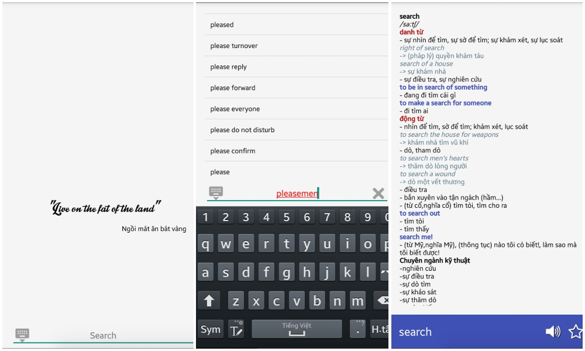

# Superfast Dictionary
> English-Vietnamese Dictionary Android Application  

   

### Check out at Google Store: [Superfast Dictionary](https://play.google.com/store/apps/details?id=fukie.sieunhanhav)

## Table of contents
- [Requirements](#requirements)
- [Screenshots](#screenshots)
- [Usage](#usage)
- [License](#license)

## Requirements
- Android Studio
## Screenshots

## Usage
- Replace `anhviet.json` and `vietanh.jon` file in assets folder if you want to make a dictionary with other languages (converted from `.dict` file).
- Dictionary source is retrieved from [StarDict](http://www.stardict.org/)
## License
Superfast Dictionary is opensource, contribution and feed back are very welcome.  
This project is distributed under    

